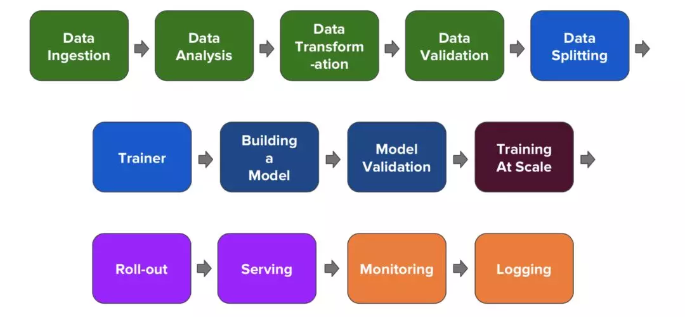
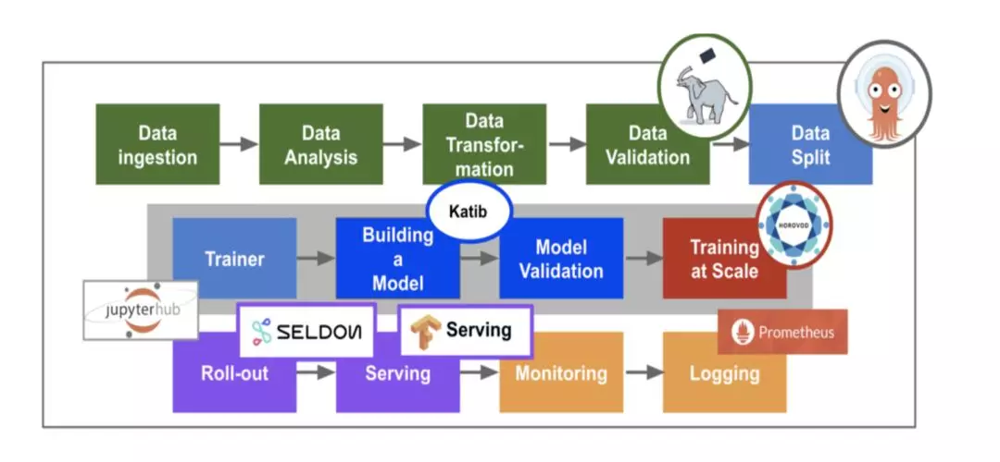
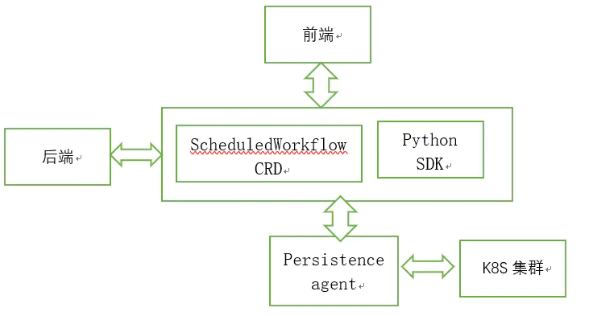

<!-- START doctoc generated TOC please keep comment here to allow auto update -->
<!-- DON'T EDIT THIS SECTION, INSTEAD RE-RUN doctoc TO UPDATE -->
**Table of Contents**  *generated with [DocToc](https://github.com/thlorenz/doctoc)*

- [机器学习模型服务上线经历的阶段](#%E6%9C%BA%E5%99%A8%E5%AD%A6%E4%B9%A0%E6%A8%A1%E5%9E%8B%E6%9C%8D%E5%8A%A1%E4%B8%8A%E7%BA%BF%E7%BB%8F%E5%8E%86%E7%9A%84%E9%98%B6%E6%AE%B5)
- [核心组件](#%E6%A0%B8%E5%BF%83%E7%BB%84%E4%BB%B6)
- [框架的作用](#%E6%A1%86%E6%9E%B6%E7%9A%84%E4%BD%9C%E7%94%A8)
  - [pipelines](#pipelines)

<!-- END doctoc generated TOC please keep comment here to allow auto update -->

# 机器学习模型服务上线经历的阶段


每种颜色代表对一个阶段的处理
```
数据提取 -> 数据分析 -> 数据转换 -> 数据验证 ->
数据集切分 -> 训练 -> 
构建模型 -> 模型验证(评估) ->
大规模训练 - 
模型服务上线 ->
监控 -> 
日志
```
git 
# 核心组件
- jupyter 
  - 创建和管理多用户交互式Jupyter notebooks
- Tensorflow/[PyTorch] 
  - 当前主要支持的机器学习引擎
- Seldon 
  - 提供在 Kubernetes 上对机器学习模型的部署
- TF-Serving 
  - 提供对 Tensorflow 模型的在线部署，支持版本控制及无需停止线上服务，切换模型等功能
- Argo 
  - 基于 Kubernetes 的工作流引擎，并实现为一个K8S的CRD(CustomResourceDefinition)
- Ambassador 对外提供统一服务的网关(API Gateway)
  - 对外提供统一服务的网关(API Gateway)，它是一个 Kubernetes 原生的微服务 API 网关，它部署在网络边缘，将传入网络的流量路由到相应的内部服务（也被称为“南北”流量）
- Istio 
  - 提供微服务的管理，Telemetry 收集
- Ksonnet Kubeflow 
  - 使用 ksonnet 来向 kubernetes 集群部署需要的 k8s 资源
- pipelines
  - pipelines是 Kubeflow 社区新近开源的端到端的 ML/DL 工作流系统，实现了一个工作流模型
  - 所谓工作流，或者称之为流水线（pipeline），可以将其当做一个有向无环图（DAG）
  - 其中的每一个节点，在 kubeflow/pipelines 的语义下被称作组件（component）
  - 组件在图中作为一个节点，其会处理真正的逻辑，比如预处理，数据清洗，模型训练等等
  - 每一个组件负责的功能不同，但有一个共同点，即组件都是以 Docker 镜像的方式被打包，以容器的方式被运行的。
- Katib
  - Katib是一个超参数训练系统。它是对 Google Vizier 的开源实现，Google Vizier 是 Google 内部的机器学习超参数训练系统的一个子系统。

# 框架的作用

将机器学习各个阶段涉及到的组件以微服务的防水进行组合并以容器化的方式进行部署， 提供整个流程各个系统的高可用及方便的进行扩展


## pipelines

架构：
- ScheduledWorkflow CRD以及其 operator
  - 扩展了argoproj/argo 的 Workflow 定义，负责真正地在 Kubernetes 上按照拓扑序创建出对应的容器完成流水线的逻辑
- 流水线前端
- 流水线后端
  - 依赖关系存储数据库（如 MySQL）和对象存储（如 Amazon S3），处理所有流水线中的 CRUD 请求
- Python SDK
  - 负责构造出流水线，并且根据流水线构造出 ScheduledWorkflow 的 YAML 定义，随后将其作为参数传递给流水线系统的后端服务
- persistence agent
  - 负责把数据从 Kubernetes Master 的 etcd 中 sync 到后端服务的关系型数据库中，其实现的方式与 CRD operator 类似，通过 informer 来监听 Kubernetes apiserver 对应资源实现


