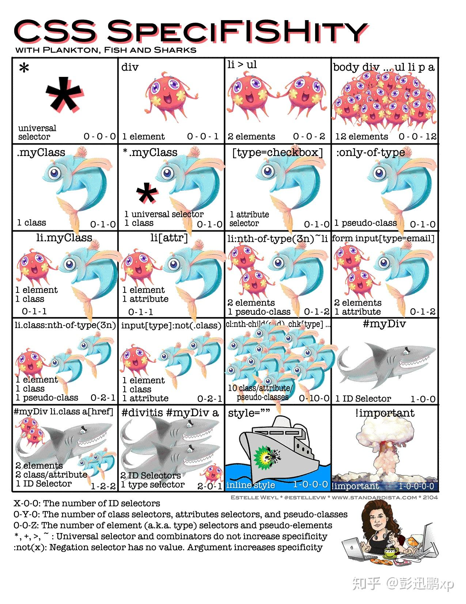

# 选择器
- 通配符选择器

      *{ margin: 0; }

- ID选择器

      #id { color: red;}
    id名在同一个文档中是惟一的(是种规范, 可能在一些浏览器中并不会报错, 但是当使用document.getElementById('')是只会选择第一个), 因此id名不能重复


- 类选择器

      .name {}

      指定标签的class名

- 元素选择器

      p {}

- 属性选择器

        a[href]

- 后代(包含)选择器

        .div .p1 {}
- 兄弟选择器

        .div + p {}

- 子选择器

        .div > p {}

- 伪类选择器(匹配的元素在html中是存在的)
  
      - :link、:visited、:hover、:active
      - :focus
      - :first-child
      - :last-child
      - :nth-child()
      - :enabled
      - :enabled
      - :checked
- 伪元素(匹配html中不存在的元素)

    伪元素的本质是在不增加dom结构的基础上添加的一个元素
  
      - ::before, 为匹配到的元素创建第一个子元素，是一个行内元素， 不能用于img,br
      - ::after
      - ::first-line, 匹配在块级元素中的第一行
      - ::first-letter, 匹配在块级元素中的第一行的第一个字母

### 优先级

```
不同级别：

!important > 行内样式 > ID选择器 > class选择器/属性选择器/伪类选择器 > 标签选择器/伪元素选择器 > 通配符选择器
```
```
同一级别中：

后写的样式会覆盖先写的样式
```

```
优先级计算：

选择器分为4个等级及权重
- 行内样式    1000
- ID选择器    0100
- class选择器/属性选择器/伪类选择器  0010
- 标签选择器/伪元素选择器   0001
```
从左到由对每个选择器计算权重， 例：

```
#b1 #b2 a {} -> 0201
#b1 .b2 a {} -> 0111
#b1 p.b2 a {} -> 0112  -> 1ID 1class 2element 
#b1 p.b2 a[href] {} -> 0122 -> 1ID 2class/attr 2element
```



``比较规则：``
**从左到右进行比较，数值较大的优先；如果相等，则向右比较下一位，数值较大的优先；如果4位数全部相等，则后声明的优先。**

一条匹配规则一般由多个选择器组成，一条规则的特殊性由组成它的选择器的特殊性累加而成。选择器的特殊性可以分为四个等级，
第一个等级是行内样式，为1000，第二个等级是id选择器，为0100，第三个等级是类选择器、伪类选择器和属性选择器，为0010，
第四个等级是元素选择器和伪元素选择器，为0001。规则中每出现一个选择器，就将它的特殊性进行叠加，这个叠加只限于对应的等
级的叠加，不会产生进位。选择器特殊性值的比较是从左向右排序的，也就是说以1开头的特殊性值比所有以0开头的特殊性值要大。
比如说特殊性值为1000的的规则优先级就要比特殊性值为0999的规则高。如果两个规则的特殊性值相等的时候，那么就会根据它们引
入的顺序，后出现的规则的优先级最高。

例：
```
<div id="id" class="class1">
    <div class="class2">
        <span class="class3">元素</span>
    </div>
</div>
// 0120
#id .class2 .class3{
  color: red;
}
// 0111
#id .class2 span{
  color: green;
}
// 0110
#id .class3 {
  color: blue;
}
// 0111
#id div .class3 {
  color: yellow;
}
// 0121
#id div.class2 .class3{
  color: yellowgreen;
}

```
比较上面权重，所以span的显示颜色为yellowgreen

```
div#id .class2 .class3 {
  color: yellowgreen;
}
```
比重相同，则后面的样式会覆盖前面的样式

# css优化
- id选择器前面不需要加标签名
- 对于无重复命名的class，不需要在class前加标签
- 层级嵌套不要过深