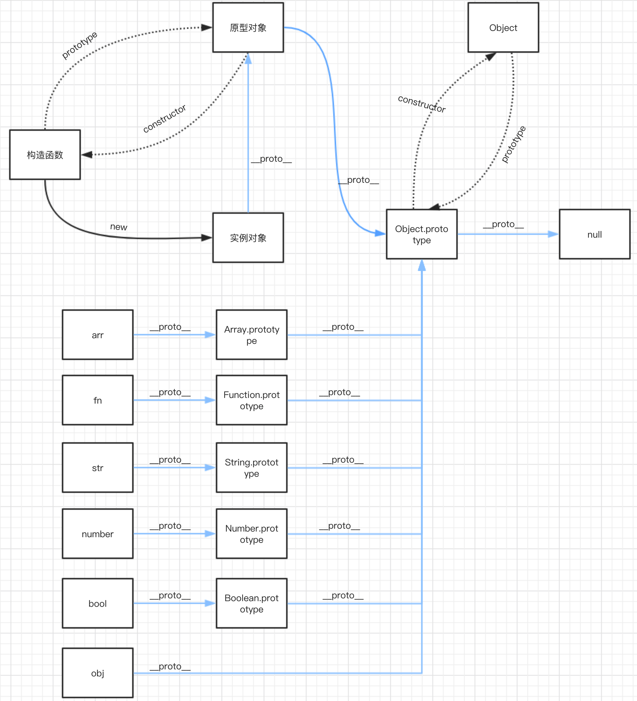
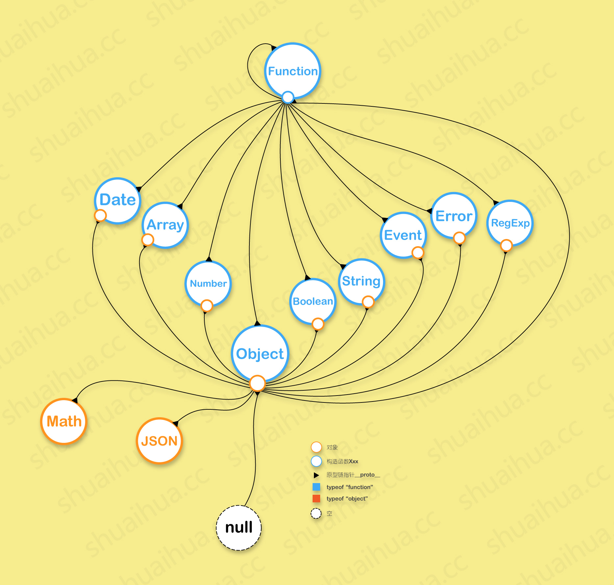

<!-- START doctoc generated TOC please keep comment here to allow auto update -->
<!-- DON'T EDIT THIS SECTION, INSTEAD RE-RUN doctoc TO UPDATE -->
**Table of Contents**  *generated with [DocToc](https://github.com/thlorenz/doctoc)*

- [构造函数](#%E6%9E%84%E9%80%A0%E5%87%BD%E6%95%B0)
- [实例](#%E5%AE%9E%E4%BE%8B)
- [原型](#%E5%8E%9F%E5%9E%8B)
- [原型链](#%E5%8E%9F%E5%9E%8B%E9%93%BE)
      - [作用](#%E4%BD%9C%E7%94%A8)
- [继承](#%E7%BB%A7%E6%89%BF)
- [问答](#%E9%97%AE%E7%AD%94)
  - [`js原型链，原型链的顶端是什么？Object的原型是什么？Object的原型的原型是什么？在数组原型链上实现删除数组重复数据的方法`](#js%E5%8E%9F%E5%9E%8B%E9%93%BE%E5%8E%9F%E5%9E%8B%E9%93%BE%E7%9A%84%E9%A1%B6%E7%AB%AF%E6%98%AF%E4%BB%80%E4%B9%88object%E7%9A%84%E5%8E%9F%E5%9E%8B%E6%98%AF%E4%BB%80%E4%B9%88object%E7%9A%84%E5%8E%9F%E5%9E%8B%E7%9A%84%E5%8E%9F%E5%9E%8B%E6%98%AF%E4%BB%80%E4%B9%88%E5%9C%A8%E6%95%B0%E7%BB%84%E5%8E%9F%E5%9E%8B%E9%93%BE%E4%B8%8A%E5%AE%9E%E7%8E%B0%E5%88%A0%E9%99%A4%E6%95%B0%E7%BB%84%E9%87%8D%E5%A4%8D%E6%95%B0%E6%8D%AE%E7%9A%84%E6%96%B9%E6%B3%95)

<!-- END doctoc generated TOC please keep comment here to allow auto update -->

## 构造函数
- 构造函数也是一个对象
- 每个构造函数都有一个prototype属性， 这个属性是一个指针，指向它的原型对象
## 实例
- 实例是通过构造函数创建的
- 每个实例对象在创建的时候都包含一个__proto__属性， 指向原型对象
- 实例继承原型对象的所有属性和方法
## 原型
- 每个js对象（除null）在创建的时候都会与之相关联一个对象， 这个对象就是所说的原型对象 （ 实例对象通过 __proto__联系原型对象 ）
- 原型本身也是一个对象， 初始化的时候是一个空的对象
- 函数prototype属性指向原型对象， 在这个对象中定义需要被继承的属性和方法， 这些属性和方法被所有实例共享
- 原型对象有一个constructor属性，指向它的构造函数

通过下面的关系图， 进一步了解一下

## 原型链
- 原型的值可以是一个对象,也可以是null。如果它的值是一个对象，则这个对象也一定有自己的原型。这样就形成了一条线性的链，我们称之为原型链。
- 原型链是由一些用来继承和共享属性的对象组成的（有限的）对象链
- 实例， 原型， 原型的原型之间通过属性__proto__建立关联，这条相关联的线就是原型链， 如上图中蓝色的线
##### 作用
当从一个对象中获取属性和方法的时候， 如果这个对象本身不存在这样的属性或方法， 就会根据__proto__去自己关联的原型对象上查找，(因为对象被创建的时候，会继承创建该对象的构造函数的prototype对象的属性和方法)， 如果在原型上也没有找到， 就会到原型的原型对象（__proto__.__proto__）上查找， 直到原型对象为null(Object.prototype.__proto__ === null)则停止查找，未找到就返回undefined

## 继承
原型对象上的属性和方法会被相关联的所有实例共享，继而这些实例也会共享原型的原型上的所有属性和方法， 这就是继承，继承是依靠原型链来实现的

- **访问属性与给属性赋值不同， 访问属性时如果属性不存在会在原型链上查找， 而给属性赋值时， 如果属性不存在， 会创建该属性**

通过一个例子看一下

    function Fn(name) {
        this.name = name;
    }
    Fn.prototype.age = 18;
    Fn.prototype.sayName = function() {
        console.log(`I am ${this.name}`);
    }
    var p1 = new Fn('p1');
    var p2 = new Fn('p2');
    p1.sayName();
    p2.sayName();
    console.log(p1.age);
    console.log(p2.age);
我们定义一个构造函数Fn, 构造函数的prototype指向它的原型对象， 在原型对象上定义属性和方法， 这些属性和方法会被所有实例共享， 由age属性和sayName方法可见。

通过图来看一下这些对象的联系

实例p1, p2分别均继承了原型对象的属性和方法，(这里的继承实质上是一种指向关系)， 这样实例便可以访问该属性和方法。

    p1.age = 20; // 赋值， 属性不存在会直接创建
    console.log(p1.age, p2.age); // 20, 18; p1定义了属性age， 查找时便不会再到原型上查找

    再来看这个， 我们通过函数去修改属性

    Fn.prototype.updateAttr = function(age) {
        this.age = age;
    }
    
    // p1: {name: "p1", age: 20} ; 原p1
    // p2: {name: "p2"}  ; 原p2
    p1.updateAttr(25);
    p1.age; // 25  此时是将p1内部属性age改为了25
    p2.updateAttr(26); // p2调用原型方法
    p2.age; // 26 
    p2__proto__.age; // 18
    可见，p2在调用函数的时候，发现自己内部没有age属性， 便生成了自己的属性同时赋值

## 问答

### `js原型链，原型链的顶端是什么？Object的原型是什么？Object的原型的原型是什么？在数组原型链上实现删除数组重复数据的方法`

- 原型
- 原型链

        var A = {};
        var B = function(){};

        A.__proto__ === ?    Object.prototype
        B.__proto__ === ?    Function.prototype

    `内置构造函数的原型均指向函数的原型对象`

        Object.__proto__ === ?    Function.prototype
        Function.__proto__ === ?`  Function.prototype
        Date.__proto__ === ?`  Function.prototype
        Number.__proto__ === ?`  Function.prototype
        String.__proto__ === ?`  Function.prototype
        Array.__proto__ === ?`  Function.prototype
        Boolean.__proto__ === ?`  Function.prototype

- 原型链的顶端是 Object.prototype

        Function.prototype.__proto__ === Object.prototype
        Array.prototype.__proto__ === Object.prototype

- var a = Object.create(null); a => {}

    a.__proto__ ;// undefined
    对象的原型是能是对象或者null

- Object的原型是对象或者是null

    Object.prototype === Object.prototype