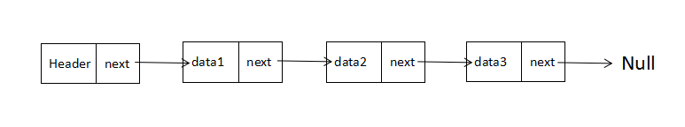
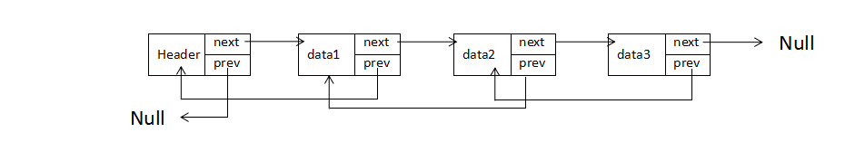

### 什么是链表？

链表（Linked List）是一种在物理上（内存空间）非连续，非顺序的数据结构，由若干节点组成

### 单向链表

单向链表的每个节点包含两部分，一部分是存储数据的变量data，另一部分存储下一个节点的指针next

    private static class Node {
        int data;
        Node next;
    }

### 双向链表

每一个节点除了data和next指针外，还存储了一个指向前置节点的prev指针

    private static class Node {
        int data;
        Node next;
        Node prev;
    }

### 链表的操作
