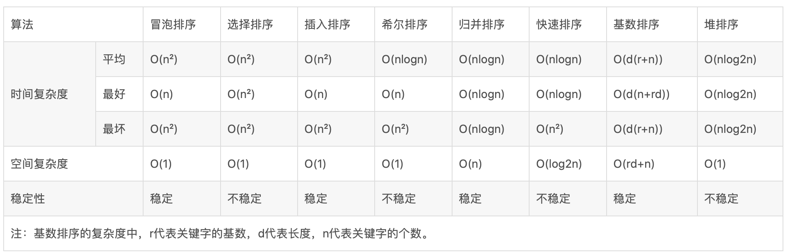

- [冒泡排序](./冒泡排序.md)
- [选择排序](./选择排序.md)
- [插入排序](./插入排序.md)
- [快速排序](./快速排序.md)
- [堆排序](./堆排序.md)
- [归并排序](./归并排序.md)
- [基数排序](./基数排序.md)
- [希尔排序](./希尔排序.md)
- [桶排序](./桶排序.md)

## 时间复杂度和空间复杂度

https://www.cnblogs.com/onepixel/p/7674659.html

常用的时间复杂度所耗费的时间从小到大依次是：
O(1) < O(logn) < (n) < O(nlogn) < O(n^2) < O(n^3) < O(2^n) < O(n!) < O(n^n)

### 计算时间复杂度
1、用常数1取代运行时间中的所有加法常数。

2、在修改后的运行次数函数中，只保留最高阶项。

3、如果最高阶项存在且不是1，则去除与这个项目相乘的常数。得到的结果就是大O阶。

### 计算空间复杂度

- 忽略常数，用O(1)表示 
- 递归算法的空间复杂度=递归深度N*每次递归所要的辅助空间 
- 对于单线程来说，递归有运行时堆栈，求的是递归最深的那一次压栈所耗费的空间的个数，因为递归最深的那一次所耗费的空间足以容纳它所有递归过程。