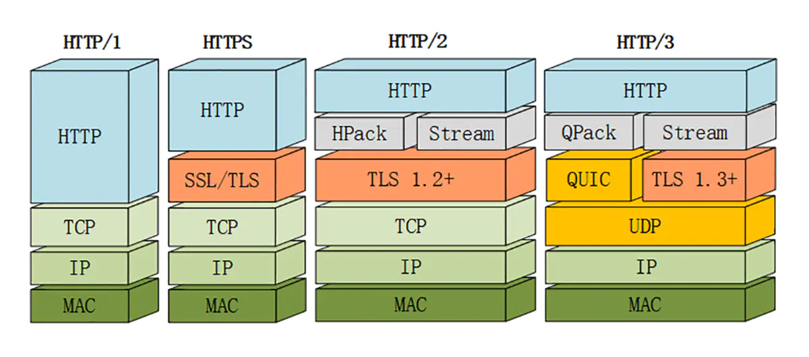

# HTTP报文
- 请求报文：
  - 请求行： 方法 URL HTTP协议版本
  - 请求头：
    - Connection 连接管理
    - Hosts 指定请求资源的主机
    - User-agent 发送请求方的用户信息
    - Accept 首选的内容类型
    - Accept-Lanage 首选的语言
  - 空行： 指示请求头内容已结束
  - 请求体
  
- 响应报文：
  - 状态行：协议版本 状态码 原因短语
  - 响应头
    - Date： 响应产生的时间
    - Content-Type: 内容类型
    - Content-Length: 内容长度
    - Connection: keep-alive, 连接状态
    - ETage: 资源的标识
    - Last-Modified: 资源最后修改的时间
    - X-Cache: 表明请求是由代理服务器返回的
    - Access-Control-Allow-Origin, 指定支持哪些来源发送的请求
  - 空行
  - 响应体

# HTTP1.0
- 1996年5月发布
- 能床送多种格式的内容，包括文字，图片，视频，二进制文件等
- 支持get, postm head方法
- 完整的请求报文包括：
  - 请求行： 方法 URL HTTP协议版本
  - 请求头
  - 空行： 指示请求头内容已结束
  - 请求体
- 响应报文
  - 状态行：协议版本 状态码 原因短语
  - 响应头
  - 空行
  - 响应体

# HTTP1.1

- 1997年1月发布
- 新增方法：PUT, OPTIONS, DELETE，PATCH
- 新增了缓存机制 cache-control, Etag(if-none-match)
- 默认使用持久化连接(connection: keep-alive),即TCP连接可以被多个请求复用.
    
    不过服务器必须按照发送的顺序返回响应信息，如果其中一个请求失败，客户端必须等待请求重发并接受成功后才能进行后面的处理

- 引入管道机制，在同一个TCP连接中，可以发送多个请求

# HTTP2.0

- 2015年发布
- 头信息和数据体使用二进制来传输文本，解析错误少，更高效
  
- 复用TCP连接，在同一个连接内， 客户端和服务器端可以发送多个请求和响应，并且不必按照顺序传送，是对HTTP1.1中管道通信的进一步优化，但是如果传输过程中出现丢包，TCP需要等待重传，这样导致之后的数据全部处于等待过程导致阻塞
  
- 头部信息压缩后在发送

- 服务器推送， 支持服务器制动向客户端发送资源

# HTTP3
- 2018年
- 传输层使用UDP协议
- 在UDP协议的基础上，新增了QUIC协议，QUIC协议提供了类似HTTP2的流功能

# HTTP1.0与HTTP1.1的区别
- 长连接
- 缓存处理
- 请求方式增加
- host属性
  - HTTP/1.1 的请求消息和响应消息都应该支持 Host 头域，且请求消息中如果没有 Host 头域会报 400 错误

# HTTP1.2与HTTP2的区别
- HTTP/2 采用二进制格式传输数据，而非 HTTP/1.x 的文本格式，二进制协议解析起来更高效。
- 头部压缩
  - HTTP/1.x 会在请求和响应中重复地携带不常改变的、冗长的头部数据，给网络带来额外的负担
  - HTTP/2 在客户端和服务端使用 “首部表” 来跟踪和存储之前发送的键值对，对于相同的数据，不再通过每次请求和响应发送；
- 服务端推送
  - 服务端可以在发送 HTML 时主动推送其他资源，而不是等浏览器解析到相应位置，发起请求再响应
  - 服务端可以主动推送，客户端也有权利选择是否接受。如果服务端推送的资源已经被浏览器缓存过，浏览器可以通过发送 RST_STREAM 帧来拒收。
  - 主动推送也遵守同源策略，服务器不会随便推送第三方资源给客户端。

- 多路复用
  - HTTP/1.x 中，如果想并发多个请求，必须使用多个 TCP 连接
  - HTTP/2 中：

    - 同域名下所有通信都在单个连接中完成；
    - 单个连接可以承载任意数量的双向数据流；
    - 数据流以消息的形式发送，而消息又由一个或多个帧组成，多个帧之间可以乱序发送，因为根据帧首部的流标识可以重新组装