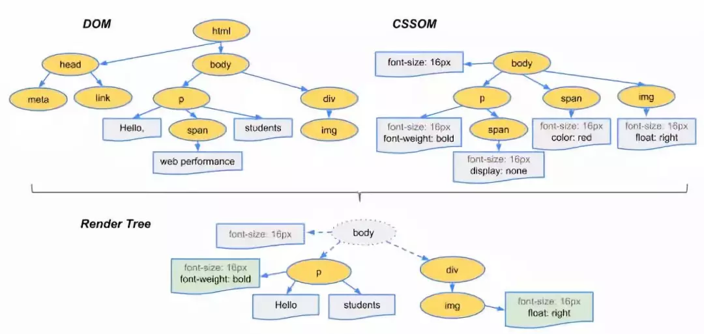

## `页面的解析和渲染`
- 解析HTML，生成DOM树；
  - 
- 解析CSS，生成CSS规则树；
- 合并DOM树和CSS规则树，生成render渲染树；
  - display: none; 的元素不会存在与渲染树中
  - css附加到render树的节点上
- 布局（layout/reflow），确定元素的位置，所在图层
  - 计算render树节点位置
- 绘制（print），绘制页面像素信息；
- 浏览器将各层的信息发送给GUI渲染引擎，GUI将各层合成，显示在屏幕上。

### 构建DOM树
浏览器从网络读取HTML的原始字节(0,1)，根据文件的编码UTF-8，将其转为html字符串，进行解析， 生成DOM树，DOM树实质上是以document为顶点的一个多叉树

解析DOM树的过程：

**字节数据(0,1数据) -> 字符串 -> 标记 -> 节点 -> DOM**
- 编码

    先将HTML的原始字节数据(0,1)转换为文件指定编码的字符

- 字符串

    根据文件的编码UTF-8，将其转为html字符串

- 标记化
    
    浏览器会根据HTML规范来将字符串转换成标记。标记会识别出当前内容是开始标签，结束标签， 属性还是文本等

    ```
    startTag html
        startTag head
            startTag title
                网站
            endTag title
        endTag head
        startTag body
        endTag body
    endTag html
    ```

- 生成节点
  
    标记过程中生成DOM节点，根据节点之间的联系生成DOM树

    一个startTag标记(或者文本标记)被生成的同时会用于DOM节点的创建，结束标记不会创建节点

- 构建完毕
    
    DOM树构建完成，整个对象集合就像是一棵树形结构。可能有人会疑惑为什么DOM是一个树形结构，这是因为标签之间含有复杂的父子关系，树形结构正好可以诠释这个关系（CSSOS同理，层叠样式也含有父子关系。例如： div p {font-size: 18px}，会先寻找所有p标签并判断它的父标签是否为div之后才会决定要不要采用这个样式进行渲染）。

### 构建CSSOM树


**字节(0,1数据) -> 字符串 -> 标记 -> 节点 -> CSSOM**

- 格式化样式表
    
  将css样式文本转化为一个结构化的对象， document.styleSheets

- 标准化样式属性
  
  例如em -> px，red -> #ff0000，bold -> 700

- 计算每个节点的具体样式

    - 继承
    - 层叠

    每个子节点都会默认继承父节点的样式属性，如果父节点中没有找到，就会采用浏览器的默认样式，这就是继承规则。

    CSS 最大的贴点在于它的层叠行，也就是最终的样式取决于各个属性共同作用的效果，甚至有很多诡异的层叠现象，这里太过复杂，不展开讨论。

所有样式数值计算完毕之后，会被挂载在 window.getComputedStyle 当中，可以通过 js 来获取元素的具体样式

### 构建渲染树


渲染树只会包括需要显示的节点和这些节点的样式信息，如果节点是script, link等，或者某个节点样式是display: none的，那就不会构建到渲染树中。

布局树生成的工作流程大致如下：

- 遍历生成的 DOM树节点，并把它们添加到布局树中；
- 计算布局树节点的坐标位置。

`浏览器在渲染过程中遇到js文件怎么办？`
```
在渲染过程中，如果遇到`<script>就停止渲染，执行JS代码`,因为浏览器有GUI渲染线程和JS引擎线程，这两个线程是互斥的

JavaScript的加载、解析和执行会阻塞DOM的构建, 也就是说，在构建DOM时，HTML解析器若遇到了JavaScript，那么它会暂停构建DOM，将控制权移交给JavaScript引擎，等JavaScript引擎运行完毕，浏览器再从中断的地方恢复DOM构建

JS文件会导致CSSOM也阻塞DOM的构建：这是因为JavaScript不只是可以改DOM，它还可以更改样式，也就是它可以更改CSSOM
```

### 建立图层树，生成layer tree
一般情况下，节点的图层会默认属于父亲节点的图层， 但是也会有脱离父节点的图层， 主要包括：

1. 拥有层叠上下文的节点

    - 普通元素position不等于static，并且设置了z-index属性
    - 设置元素的透明度， option值不为1
    - 元素的filter值不为none（设置元素的可视效果）
    - 元素的transform属性不为none
    - 元素的isolation: isolate;属性
    - will-change: transform, opacity等属性（告知浏览器该元素会有哪些变化的方法，这样浏览器可以在元素属性真正发生变化之前提前做好对应的优化准备工作）

2. 在固定高度的元素上设置滚动条属性

图层的重绘只会影响该图层本身， 不会影响其他图层

### 绘制
将图层拆分成单独的绘制指令，按顺序组合成一个待绘制列表

### 渲染


